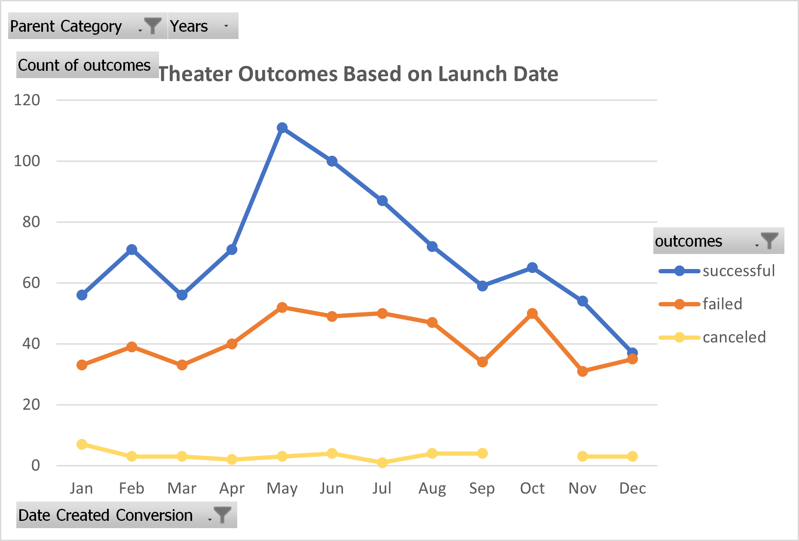
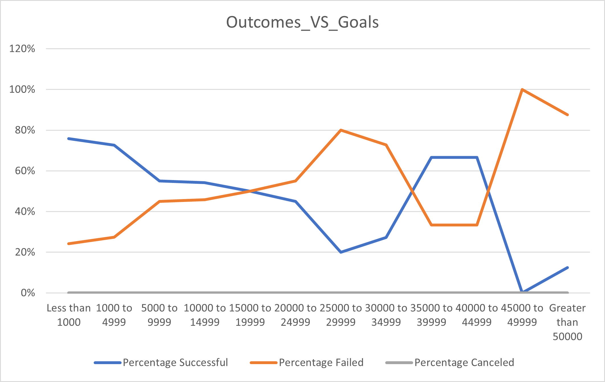

# Kickstarting with Excel

## Overview of Project
The data set was provided with a list of activities brought out in different countrys for fundrising, the details of each activity and the outcomes. Through this projects, we performed data analysis around the outcomes based on the launch dates and funding goals.
Louise, the fundriser for her play *Fever* in tend to use the results from this analysis to understand the effects of different affectors to the outcomes.
### Purpose
The purpose is to find out the relationship between each campaign and their launch dates and funding goals. 
## Analysis and Challenges
As indicated above, by performing analysis between the outcomes and the launch date and goals, we were able to found out the month May as the most successful month for launching a play. The capaigns with goals below $1000 has the most successful rate.  
Some challenges occured during the analysis are: the outcomes and goals analysis does provide a perspective for Louise. However, it's doesn't show how the data spread. As the campaigns with goals between $35000 to $44999 also show pretty good (above 60%) successful rate, the chart doesn't give a clear idea for Louise to set her goal.

### Analysis of Outcomes Based on Launch Date
 
  This chart shows the donation outcomes of theraters in different months. Based on the chart, plays that were launched in May has the highest amount of successful outcomes, followed by plays launched in June and July. This result suggests to launch a play between May to July for better outcomes.
### Analysis of Outcomes Based on Goals

  This chart shows the amount of donation from plays in relationship with the goals. Campaigns with goals below $1000 has the highest sucessful rate, near to 80%. However, campaigns with goals between $35000 to $44999 also returned with above 60% successful rate. 
### Challenges and Difficulties Encountered
The outcomes and goals chart doesn't deliver enough information for Louise to make a decision about her fundrising goal. I would recommed to do an analysis on the total amount of donation generated under different goals, do a calculation for standard deviation, Mean, Median and IQR to see how the data are spread. 

## Results

- What are two conclusions you can draw about the Outcomes based on Launch Date?
1. Summer months (May, June and July) generally have higher successful rate.  
2. December has nearly half and half successful and failed rate. We would not suggest to launch a play in that month.

- What can you conclude about the Outcomes based on Goals?
1. Plays with lower than $1000 goal has the highest percentage of successful rate. 

- What are some limitations of this dataset?  
The data sets are only generated based on the count of outcomes. In cases where a goal was set too high, even if the campaign was able to generate higher amount of donation, the campaign might still be counted as a failed case. This deosn't help Louise make a decision.

- What are some other possible tables and/or graphs that we could create?  
1. A box and whisker chart can be generated for donation goal and pledged.
2. A table can be created to show the total and average pledged amount under each goal range.
